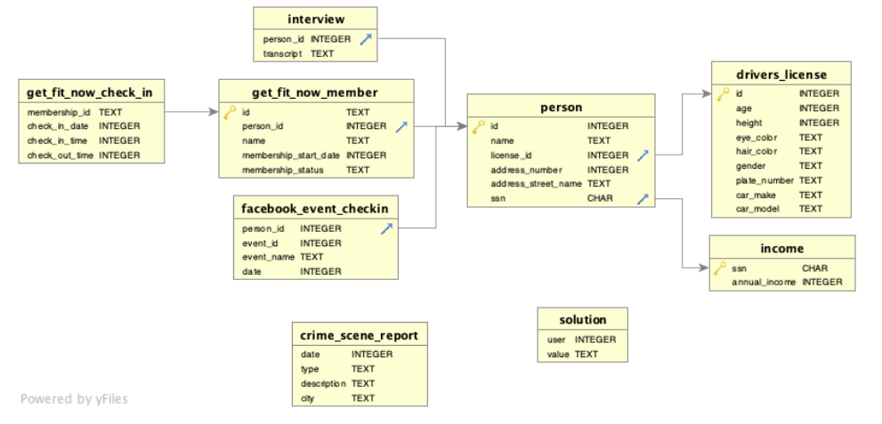

# 🕵️ SQL Murder Mystery Solution

A step-by-step walkthrough solving the Knight Lab SQL Murder Mystery using SQL queries.

🔗 **Game Link:** https://mystery.knightlab.com/

---

## 📖 Overview

This project documents the process of solving the SQL Murder Mystery, an interactive game where you act as a detective and solve a murder case using SQL queries.

The investigation starts with minimal information:

- A murder occurred on January 15, 2018
- Location: SQL City

From there, clues are extracted from multiple tables to identify:

- Witnesses
- Suspects
- The killer
- The mastermind

---

## 🗂️ Database Schema

Below is the schema used in the investigation:

---

## 🧩 How the Investigation Works

Each step of the case is broken down into separate SQL files:

| Step | Description |
|------|-------------|
| 1 | Retrieve the crime scene report |
| 2 | Identify and locate witnesses |
| 3 | Analyze witness interviews |
| 4 | Track down the suspect using clues |
| 5 | Confirm the killer |
| 6 | Uncover the mastermind |

Each file contains:

- SQL queries
- Comments explaining the reasoning
- Clue-by-clue progression

---

## ⚠️ Spoiler Warning

**This repository contains the full solution to the mystery.**

If you want to try solving the case yourself:  
👉 **Play the game first** before checking the SQL files.

---

## 🚀 How to Use This Repo

- Start from **Step 1** and follow the sequence
- Read the comments in each SQL file carefully
- Understand **why** each query is written, not just the output

---

## 🛠️ Tech Used

- SQL (SQLite)
- Relational Database Concepts

---

## 🎯 Learning Outcomes

- Writing real-world SQL queries
- Working with joins and filtering
- Extracting insights from relational data
- Thinking step-by-step like a problem solver

---

## 📜 License

This project is licensed under the **MIT License**.

---

## 🙌 Credits

Original game by **knightlab**.  
🔗 https://mystery.knightlab.com/
